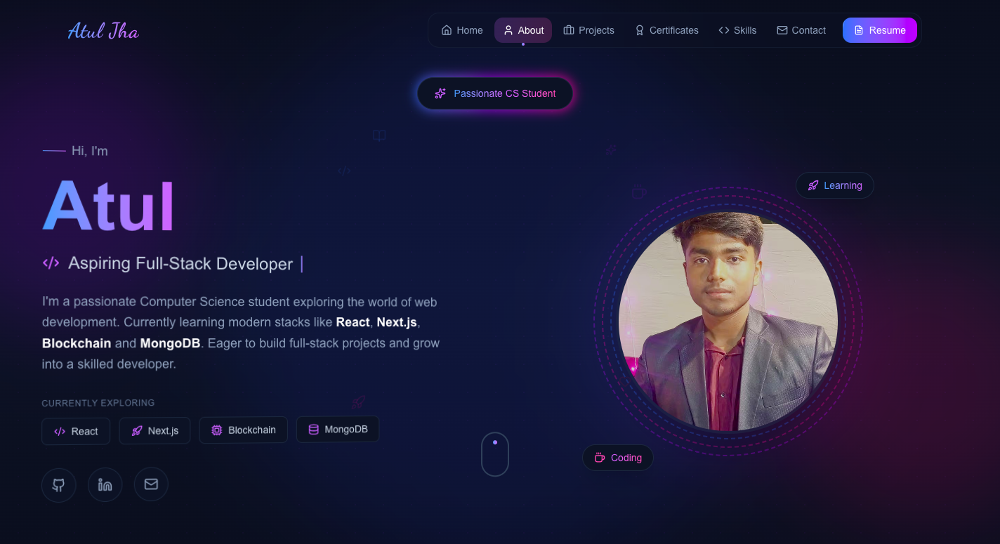

# ✨ Nguyen Xuan Van – Portfolio Website

> A modern, performance-focused portfolio designed to showcase projects, structured case studies, and UI/UX thinking.

---

## 🌐 Live Website

🔗 **https://atuljhaportfoliosite.vercel.app/**

---

## 📸 Preview

---

## 🚀 Key Features

✔ Clean, modern UI with strong visual hierarchy  
✔ Fully responsive across mobile, tablet, and desktop  
✔ Case-study driven project presentation  
✔ Smooth micro-interactions & scroll animations  
✔ Structured storytelling layout  
✔ Performance-optimized using Next.js  
✔ Deployed seamlessly on Vercel  

---

## 🧠 What Makes This Portfolio Different?

Instead of simply listing projects, this portfolio presents structured thinking:

- Problem → Approach → Design Decisions → Outcome  
- Focus on clarity and usability  
- Intentional spacing, typography, and interaction design  
- Built as an experience, not just a webpage  

---

## 🛠 Tech Stack

| Technology | Purpose |
|------------|----------|
| Next.js | Framework |
| TypeScript | Type Safety |
| Tailwind CSS | Styling |
| Vercel | Deployment |

---

## 📂 Project Structure

├── app/
├── components/
├── public/
│ └── ss.png
├── styles/
└── README.md

---

## ⚡ Performance & Optimization

- Optimized production build
- Responsive image handling
- Clean component architecture
- SEO-friendly structure

---

## 📬 Connect With Me

If you’d like to collaborate or discuss ideas:

- LinkedIn: (Add your link)
- Email: (Add your email)

---

## ⭐ Support

If you found this project helpful or inspiring, consider giving it a star!

---

### Built with clarity. Designed with intention.
